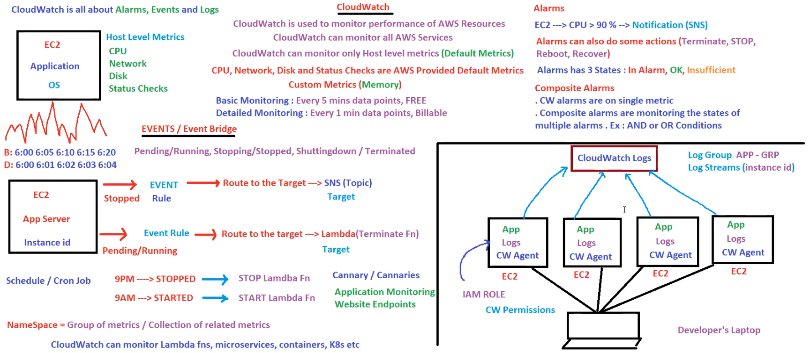

# Detailed Explanation of CloudWatch Components

#### 1. **CloudWatch Overview**

- **Purpose:** 
  - CloudWatch is used to monitor the performance and health of AWS resources such as EC2 instances, databases, and more.
  - It can monitor both AWS services and on-premises resources.
- **Monitored Metrics:**
  - **Default Metrics:** These include CPU utilization, network traffic, disk usage, and status checks that AWS provides by default.
  - **Custom Metrics:** Users can define and monitor their custom metrics, such as memory usage or application-specific metrics.

#### 2. **Metrics and Logs**

- **Host Level Metrics:**
  - **CPU:** Monitor CPU utilization to understand the processing load on an instance.
  - **Network:** Track data transfer rates to identify potential network bottlenecks.
  - **Disk:** Monitor disk read/write operations to ensure storage performance.
  - **Status Checks:** AWS performs automated checks on EC2 instances to detect issues like hardware or network connectivity problems.

- **Custom Metrics (Memory):**
  - Custom metrics allow users to monitor specific application or system performance metrics not covered by default metrics, such as memory usage.
  
#### 3. **Monitoring Types**

- **Basic Monitoring:**
  - Provides metrics at 5-minute intervals for free.
  - Suitable for general performance monitoring where detailed granularity is not required.

- **Detailed Monitoring:**
  - Offers 1-minute interval metrics, which are billable.
  - Useful for applications requiring precise and detailed performance data.

#### 4. **Events/Event Bridge**

- **Event Types:**
  - **Pending/Running, Stopping/Stopped, Shutting down/Terminated:** These events track the lifecycle of an EC2 instance.
- **Event Bridge:**
  - Allows routing of these events to different AWS services or custom targets.
  
- **Event Rules:**
  - Define actions based on instance states. For example, when an instance stops, an event rule can trigger a notification or another action.
  - **Routing to SNS (Simple Notification Service):** Sends notifications to subscribers (email, SMS, etc.) when an event occurs.
  - **Routing to Lambda:** Invokes a Lambda function to perform tasks such as terminating an instance or updating a database.

#### 5. **Alarms**

- **Conditions:**
  - **Threshold-based Alarms:** Triggered when a metric exceeds a defined threshold (e.g., CPU > 90%).
- **Actions:**
  - **Notifications:** Send alerts via SNS to administrators.
  - **Automated Actions:** Perform actions like terminating, stopping, or rebooting instances.
- **States:**
  - **In Alarm:** The condition is met, and the alarm is triggered.
  - **OK:** The condition is not met, and the system is operating normally.
  - **Insufficient Data:** Not enough data to determine the state.
  
- **Composite Alarms:**
  - Monitor multiple alarms using logical operators (AND, OR).
  - Example: Trigger an alarm if both CPU utilization is high and disk space is low.

#### 6. **Log Management**

- **CloudWatch Logs:**
  - Collect, monitor, and store logs from various sources.
- **Log Groups and Log Streams:**
  - **Log Group:** A collection of log streams (e.g., logs from a specific application).
  - **Log Stream:** A sequence of log events from the same source (e.g., logs from a specific EC2 instance).
  
- **CW Agent:**
  - Installed on instances to collect and send log data to CloudWatch.
- **IAM Role:**
  - Provides necessary permissions for CW Agent to interact with CloudWatch.

#### 7. **Automation**

- **Scheduled Actions:**
  - Use cron jobs to perform actions like starting/stopping instances at specific times.
- **Canaries:**
  - Automated scripts that simulate user actions to monitor application endpoints and performance.

### Example Scenarios

#### Scenario 1: Auto-Scaling Based on Custom Metrics

**Background:**
An e-commerce website experiences fluctuating traffic. To handle high traffic, additional instances are needed, while during low traffic, some instances should be terminated to save costs. Memory usage is critical for the application.

**Implementation:**

1. **Custom Metric for Memory Usage:**
   - Install and configure the CloudWatch Agent to monitor memory usage on EC2 instances.
   - Create a custom metric in CloudWatch for memory usage.

2. **Set Up Alarms:**
   - Create an alarm for high memory usage (e.g., memory > 75% for 5 minutes).
   - Create an alarm for low memory usage (e.g., memory < 30% for 10 minutes).

3. **Auto-Scaling Policies:**
   - **Scale-Up Policy:** 
     - When the high memory usage alarm is triggered, invoke a Lambda function that increases the number of instances in the auto-scaling group.
   - **Scale-Down Policy:** 
     - When the low memory usage alarm is triggered, invoke a Lambda function that decreases the number of instances.

4. **Event Rule:**
   - Configure an event rule to monitor instance states (e.g., pending, running, stopping).
   - Route these events to an SNS topic to notify the admin team about scaling activities.

**Outcome:**
- The e-commerce website dynamically scales up and down based on real-time memory usage, ensuring optimal performance and cost efficiency.

#### Scenario 2: Automated Instance Health Check and Recovery

**Background:**
A critical application runs on an EC2 instance. To ensure high availability, the instance should be automatically replaced if it becomes unhealthy.

**Implementation:**

1. **Health Check Metric:**
   - Enable detailed monitoring for the EC2 instance to get 1-minute interval data.

2. **Set Up Alarms:**
   - Create an alarm for instance status check failure (e.g., instance fails the status check for 3 consecutive minutes).

3. **Lambda Function for Recovery:**
   - Create a Lambda function to terminate the unhealthy instance and launch a new instance.
   - Ensure the Lambda function is granted appropriate IAM permissions to perform EC2 actions.

4. **Event Rule:**
   - Define an event rule to monitor the stopping/terminated state of the instance.
   - Route the event to the Lambda function for recovery action.

5. **Notification Setup:**
   - Configure SNS to notify the admin team about the instance replacement.

**Outcome:**
- The application remains highly available as any unhealthy instance is automatically replaced, minimizing downtime.

### Conclusion

AWS CloudWatch provides a powerful set of tools for monitoring, logging, and automating responses to ensure the smooth operation of AWS resources. By leveraging metrics, alarms, events, and automation, users can maintain high availability, optimize performance, and reduce operational costs.

For More click Here :-  [Click Here to View Blog](https://medium.com/@aslam.muhammedclt/a-step-by-step-guide-to-setting-up-cloudwatch-alarms-for-aws-monitoring-66877304fafb) 