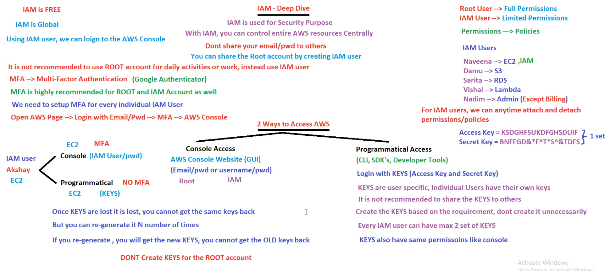
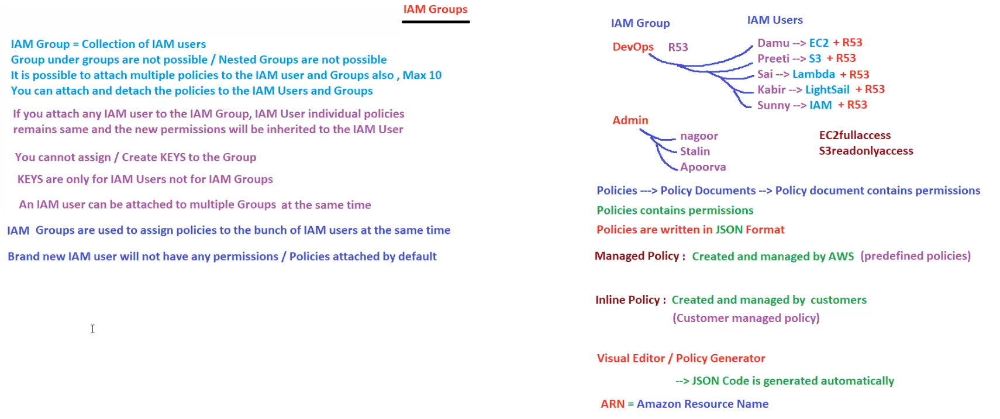
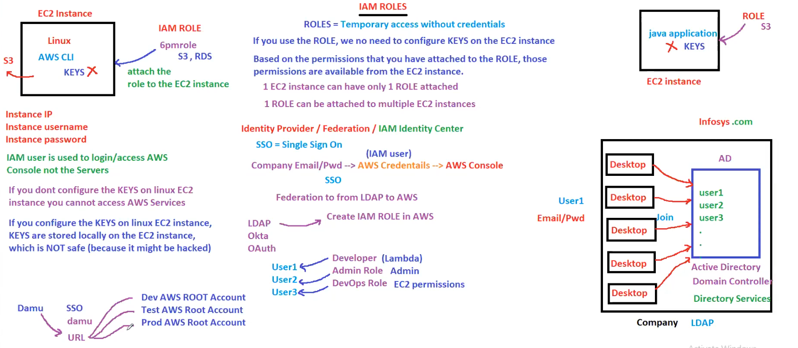
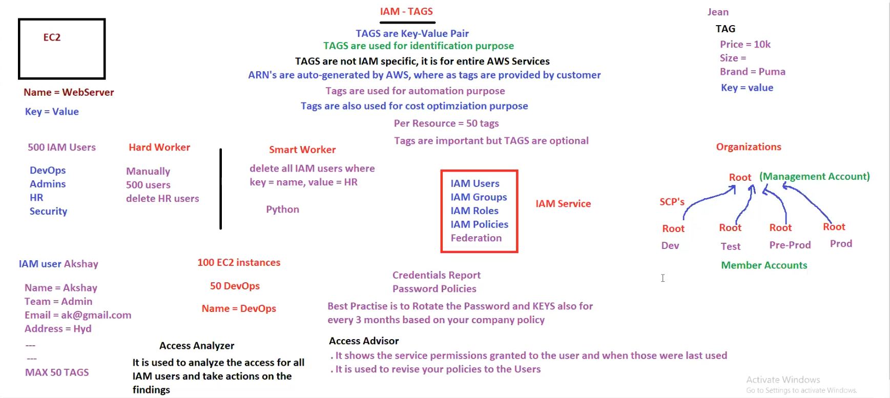
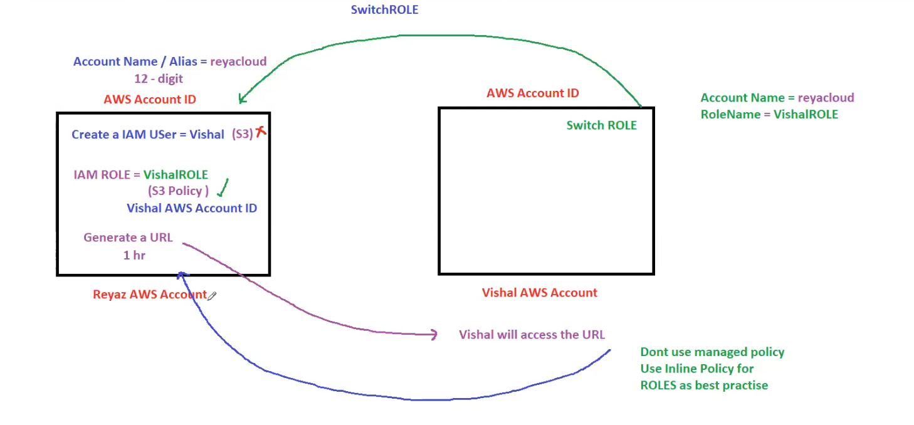

# Detailed Explanation of IAM Components

#### 1. **IAM Basics**

- **IAM is FREE:** 
  - AWS does not charge for using IAM. It’s available at no additional cost.
  
- **IAM is Global:** 
  - IAM is not region-specific; it operates globally, allowing you to manage access to your AWS resources across all regions.

- **Using IAM User:** 
  - With IAM, you can create users who can log in to the AWS Console and perform tasks based on permissions assigned to them.

#### 2. **Root Account vs. IAM User**

- **Root Account:** 
  - The root user has full permissions to access and manage all AWS resources. It is the most powerful account and should not be used for everyday tasks.
  
- **IAM User:** 
  - IAM users have limited permissions based on policies assigned to them. It is recommended to use IAM users for daily tasks to enhance security.

#### 3. **Multi-Factor Authentication (MFA)**

- **MFA Overview:**
  - MFA adds an extra layer of security by requiring users to provide a second form of authentication, typically through a mobile app like Google Authenticator.
  
- **MFA Recommendations:**
  - It is highly recommended to enable MFA for the root account and IAM users to protect against unauthorized access.
  
- **Setting Up MFA:**
  - Each IAM user should have MFA set up individually. Users log in with email/password, then complete MFA to access the AWS Console.

#### 4. **Access Methods**

- **Console Access:**
  - **AWS Console Website (GUI):** Users log in through the AWS Console website using their credentials (email/username and password).
  - **Root User:** Has full access permissions.
  - **IAM User:** Has permissions based on policies assigned.

- **Programmatical Access:**
  - **CLI, SDKs, Developer Tools:** Users can access AWS programmatically using AWS CLI, SDKs, or other developer tools.
  - **Login with Keys:** Uses Access Key ID and Secret Access Key for authentication.
  - **Keys Specifics:**
    - Keys are user-specific and should not be shared.
    - Each IAM user can have a maximum of two sets of keys.
    - Keys have the same permissions as the console access.

#### 5. **Permissions and Policies**

- **Permissions:** 
  - Define what actions an IAM user or group can perform on AWS resources.
  
- **Policies:** 
  - Documents that define permissions and are attached to users, groups, or roles.

#### 6. **IAM Users and Roles**

- **Example Users and Permissions:**
  - **Naveena:** Access to EC2 and IAM.
  - **Damu:** Access to S3.
  - **Sarita:** Access to RDS.
  - **Vishal:** Access to Lambda.
  - **Nadim:** Admin access except for billing.
  
- **Policy Attachment:**
  - IAM users can have permissions/policies attached or detached at any time, allowing flexible management of user permissions.

#### 7. **Security Best Practices**

- **Do not share your email/password with others:**
  - It is essential to keep login credentials private to prevent unauthorized access.

- **Do not use the root account for daily activities:**
  - Use IAM users instead to minimize risk.

- **Do not create keys for the root account:**
  - Keys for the root account pose a significant security risk if compromised.

#### 8. **Handling Access Keys**

- **Key Management:**
  - Once keys are lost, they cannot be retrieved. New keys must be generated if needed.
  - Regenerating keys invalidates old keys.
  
- **Creation Recommendations:**
  - Create keys only when necessary and ensure they are stored securely.

### Example Scenarios

#### Scenario 1: Securing an AWS Environment with IAM Users and MFA

**Background:**
A company wants to secure its AWS environment by creating IAM users for its team and enabling MFA for all accounts.

**Implementation:**

1. **Create IAM Users:**
   - Create IAM users for each team member (e.g., Alice, Bob, Charlie).
   - Assign appropriate policies to each user based on their roles. For instance, Alice manages EC2 instances, Bob manages S3 buckets, and Charlie is a database administrator.

2. **Enable MFA:**
   - Set up MFA for each IAM user. Each user installs Google Authenticator on their mobile device.
   - Users log in to the AWS Console with their email/password and complete the MFA setup.

3. **Enforce Security Policies:**
   - Ensure that IAM users use their accounts for daily tasks instead of the root account.
   - Regularly review and update policies to ensure least privilege access.

**Outcome:**
- The AWS environment is secured with IAM users having specific permissions and MFA adding an extra layer of security.

#### Scenario 2: Programmatic Access for Automation Scripts

**Background:**
A development team needs to automate the deployment of applications using AWS CLI scripts. They require programmatic access to AWS resources.

**Implementation:**

1. **Create IAM Users:**
   - Create IAM users for each developer who will be running the scripts (e.g., Dev1, Dev2).
   
2. **Generate Access Keys:**
   - For each IAM user, generate access keys (Access Key ID and Secret Access Key) required for programmatic access.
   - Store these keys securely, possibly in a secure secrets manager.

3. **Assign Policies:**
   - Attach policies to IAM users that grant necessary permissions for deployment tasks. For example, permissions to create and manage EC2 instances, S3 buckets, etc.

4. **Use Keys in Scripts:**
   - Developers configure their AWS CLI with the access keys.
   - Write and run automation scripts to deploy applications. Example AWS CLI commands could include `aws ec2 run-instances`, `aws s3 cp`, etc.

5. **Key Management:**
   - Regularly rotate keys and update scripts with new keys to enhance security.
   - Ensure old keys are deactivated and removed.

**Outcome:**
- Developers can automate application deployments securely using programmatic access with properly managed IAM policies and access keys.

### Conclusion

AWS IAM provides robust security and access management features that are essential for managing AWS resources effectively. By using IAM users, enabling MFA, properly managing permissions and policies, and securing access keys, organizations can enhance their security posture and ensure that AWS resources are accessed and managed securely.


<br/>
<br/>

# Detailed Explanation of IAM Groups


#### 1. **IAM Group Basics**

- **IAM Group = Collection of IAM Users:**
  - IAM Groups are used to organize and manage permissions for multiple IAM users at once.

- **Group Under Groups Are Not Possible:**
  - Nested groups are not supported in IAM, meaning you cannot have groups within groups.

- **Attach Multiple Policies:**
  - It is possible to attach multiple policies to IAM users and groups. The maximum limit is 10 policies per user or group.
  - Policies define what actions users or groups can perform on AWS resources.

- **Attach and Detach Policies:**
  - Policies can be attached or detached from IAM users and groups at any time, providing flexibility in permission management.

#### 2. **Policies and Permissions**

- **Policy Inheritance:**
  - If an IAM user is part of a group, the user inherits the policies attached to that group while retaining any individual policies.
  
- **No Keys for Groups:**
  - Access keys cannot be assigned to IAM groups; keys are only for individual IAM users.

- **Multiple Group Attachments:**
  - An IAM user can be a member of multiple groups simultaneously, inheriting the combined permissions of all groups.

- **Group Usage:**
  - IAM groups simplify the management of permissions by allowing policies to be assigned to multiple users at once.
  - New IAM users do not have any permissions by default and must be assigned policies via groups or directly.

#### 3. **Policy Types and Management**

- **Policy Documents:**
  - Policies are JSON documents that specify permissions.
  - They define what actions are allowed or denied for IAM users or groups.

- **Managed Policies:**
  - These are predefined policies created and managed by AWS. They provide a set of commonly used permissions.

- **Inline Policies:**
  - These are custom policies created and managed by customers. They are embedded directly into a user, group, or role.

- **Visual Editor/Policy Generator:**
  - AWS provides tools like the Visual Editor and Policy Generator to help create policies. These tools automatically generate the JSON code for the policies.

- **ARN (Amazon Resource Name):**
  - ARN is a unique identifier for AWS resources. Policies use ARNs to specify which resources they apply to.

### Example Scenario: Managing Permissions with IAM Groups

**Scenario: A Tech Company with Various Departments**

**Background:**
A tech company has different departments like DevOps, Development, and Administration. Each department requires specific permissions to AWS services. To manage permissions efficiently, the company uses IAM groups.

**Implementation:**

1. **Create IAM Groups:**
   - **DevOps Group:** Responsible for managing Route 53 (DNS service).
   - **Admin Group:** Has administrative access to all AWS resources except for billing.

2. **Create IAM Users and Assign to Groups:**
   - **DevOps Users:**
     - **Damu:** Needs access to EC2 and Route 53.
     - **Preeti:** Needs access to S3 and Route 53.
     - **Sai:** Needs access to Lambda and Route 53.
     - **Kabir:** Needs access to Lightsail and Route 53.
     - **Sunny:** Needs access to IAM and Route 53.
   - **Admin Users:**
     - **Nagoor, Stalin, Apoorva:** All require admin permissions.

3. **Attach Policies to Groups:**
   - **DevOps Group Policies:**
     - Attach policies that allow full access to Route 53.
   - **Admin Group Policies:**
     - Attach policies that allow full administrative access (except billing).

4. **Individual Policies for Users:**
   - Users can also have individual policies attached directly if they need permissions outside the group scope.
   - For example, Damu is also given an individual policy for EC2 full access.

**Outcome:**

- **Efficient Permission Management:**
  - By using groups, the company can manage permissions for multiple users efficiently. When a new user joins, they can be added to the appropriate group to inherit the necessary permissions.

- **Simplified Administration:**
  - IAM groups simplify the administration by reducing the need to manage individual user permissions. Policies attached to groups ensure that all members have consistent permissions.

### Detailed Step-by-Step Implementation

1. **Create IAM Groups:**
   - In the AWS Management Console, navigate to IAM.
   - Create a new group named "DevOps" and another named "Admin."

2. **Create IAM Users:**
   - Create IAM users for each team member (Damu, Preeti, Sai, Kabir, Sunny for DevOps; Nagoor, Stalin, Apoorva for Admin).

3. **Assign Users to Groups:**
   - Add each IAM user to the appropriate group. For example, add Damu, Preeti, Sai, Kabir, and Sunny to the DevOps group.

4. **Attach Policies to Groups:**
   - Attach a managed policy like `AmazonRoute53FullAccess` to the DevOps group.
   - Attach a managed policy like `AdministratorAccess` to the Admin group.

5. **Individual Policies:**
   - For Damu, attach an additional policy `AmazonEC2FullAccess` to allow full EC2 access.

**Example JSON Policy for DevOps Group (Route 53 Access):**
```json
{
  "Version": "2012-10-17",
  "Statement": [
    {
      "Effect": "Allow",
      "Action": "route53:*",
      "Resource": "*"
    }
  ]
}
```

**Example JSON Policy for Admin Group:**
```json
{
  "Version": "2012-10-17",
  "Statement": [
    {
      "Effect": "Allow",
      "Action": "*",
      "Resource": "*"
    }
  ]
}
```

### Conclusion

IAM Groups in AWS offer a streamlined way to manage permissions for multiple users. By grouping users and attaching policies to these groups, organizations can simplify their access management, ensure consistent permissions, and enhance security. Using managed and inline policies provides flexibility in defining permissions, while tools like the Visual Editor facilitate the creation of these policies. This structured approach to permission management is essential for maintaining a secure and efficient AWS environment.


<br/>
<br/>

# Detailed Explanation of IAM Roles


#### 1. **IAM Roles Basics**

- **IAM Role = Temporary Access Without Credentials:**
  - IAM Roles provide a way to grant temporary access to AWS resources without sharing long-term credentials (like access keys).

- **Role Usage:**
  - If you use a role, you do not need to configure keys on the EC2 instance.
  - Based on the permissions attached to the role, those permissions will be available from the EC2 instance.

- **Role and EC2 Instances:**
  - One EC2 instance can have only one role attached.
  - One role can be attached to multiple EC2 instances.

#### 2. **Identity Provider/Federation/IAM Identity Center**

- **Identity Provider/Federation:**
  - Federation allows you to use an external identity provider (like LDAP, Okta, OAuth) to grant access to AWS resources.

- **SSO (Single Sign-On):**
  - SSO allows users to log in to AWS using their company credentials (e.g., email and password).
  - Company email/pwd -> AWS Credentials -> AWS Console

#### 3. **Security Considerations**

- **Instance Credentials:**
  - Instance IP, username, and password are required to log in to the EC2 instance.
  - IAM users are used to log in to/access AWS Console, not the servers.

- **Key Configuration:**
  - If you don't configure the keys on a Linux EC2 instance, you cannot access AWS services.
  - Configuring keys on a Linux EC2 instance stores keys locally, which is not safe because it might be hacked.

#### 4. **Practical Application**

- **Java Application Example:**
  - An EC2 instance running a Java application with an attached role can access S3 without needing stored keys.

### Example Scenario: Using IAM Roles for Secure Access

**Scenario: A Company with EC2 Instances and S3 Access Requirements**

**Background:**
A company, Infosys.com, has multiple EC2 instances that need to access S3 buckets. Instead of using access keys, they use IAM roles for secure access.

**Implementation:**

1. **Create IAM Roles:**
   - **Role Name:** `s3accessrole`
   - **Permissions:** Allow access to S3 and RDS.

2. **Attach Roles to EC2 Instances:**
   - Attach `s3accessrole` to all EC2 instances that need access to S3.

3. **Application Configuration:**
   - Configure a Java application on an EC2 instance to use the role for accessing S3.

4. **Identity Provider Integration:**
   - Use an identity provider like LDAP for user authentication.
   - Enable Single Sign-On (SSO) for AWS access.

**Outcome:**

- **Secure Access:**
  - The EC2 instances can access S3 without storing access keys locally, reducing the risk of key exposure.
  - Users can log in to the AWS console using their company credentials.

### Detailed Step-by-Step Implementation

1. **Create IAM Role:**
   - In the AWS Management Console, navigate to IAM.
   - Create a new role named `s3accessrole`.
   - Attach policies that allow access to S3 and RDS.

2. **Attach Role to EC2 Instance:**
   - Go to the EC2 Dashboard.
   - Select the EC2 instances that need S3 access.
   - Attach the `s3accessrole` to the selected instances.

3. **Configure Application to Use Role:**
   - Ensure that the Java application running on the EC2 instance uses the default AWS SDK, which automatically picks up the IAM role credentials.

4. **Enable Identity Federation:**
   - Integrate with an identity provider like LDAP.
   - Configure AWS Single Sign-On (SSO) to allow users to authenticate using their company credentials.

**Example JSON Policy for `s3accessrole`:**
```json
{
  "Version": "2012-10-17",
  "Statement": [
    {
      "Effect": "Allow",
      "Action": [
        "s3:*",
        "rds:*"
      ],
      "Resource": "*"
    }
  ]
}
```

### Conclusion

IAM Roles provide a secure and efficient way to manage access to AWS resources without using long-term credentials. By attaching roles to EC2 instances, you can grant the necessary permissions dynamically. Integrating with identity providers and using SSO enhances security and simplifies the user authentication process. This structured approach ensures that access is managed securely, reducing the risk of credentials being compromised.


<br/>
<br/>
# Detailed Explanation of IAM Tags


#### 1. **IAM Tags Basics**

- **Tags Definition:**
  - Tags are key-value pairs used for identification purposes.
  - Tags are not IAM-specific but are applicable to all AWS services.

- **Usage and Importance of Tags:**
  - Tags are used for automation, cost optimization, and identification purposes.
  - Tags are important for managing and organizing resources but are optional.
  - Each AWS resource can have up to 50 tags.

- **Tags vs. ARN:**
  - ARNs (Amazon Resource Names) are auto-generated by AWS.
  - Tags are provided by the customer.

#### 2. **Example of Tags:**
  - **EC2 Instance:** 
    - Name = WebServer
    - Key = Value
  - **Personal Item:**
    - Jean
    - Price = 10k
    - Size = L
    - Brand = Puma

#### 3. **IAM Users and Tags:**
  - Example of tagging an IAM user:
    - **IAM user Akshay:**
      - Name: Akshay
      - Team: Admin
      - Email: ak@gmail.com
      - Address: Hyd
      - Max 50 Tags can be attached.

#### 4. **Automation and Smart Work with Tags:**

- **Hard Worker vs. Smart Worker:**
  - Hard Worker: Manually manage and delete users (e.g., 500 users, manually delete HR users).
  - Smart Worker: Automate deletion using tags (e.g., delete all IAM users where key = name, value = HR using Python).

#### 5. **AWS Organizations:**

- **Structure:**
  - Organizations allow you to manage multiple AWS accounts.
  - Root Account (Management Account) with multiple child accounts (e.g., Dev, Test, Pre-Prod, Prod).
  - Service Control Policies (SCPs) manage permissions across the organization.

#### 6. **IAM Service Components:**
  - **IAM Users**
  - **IAM Groups**
  - **IAM Roles**
  - **IAM Policies**
  - **Federation**

#### 7. **Access and Credentials Management:**
  - **Access Analyzer:** Analyzes access for all IAM users and suggests actions based on findings.
  - **Access Advisor:** Shows service permissions granted to users and when those permissions were last used.
  - **Credentials Report:** Provides details on passwords and access keys.
  - **Password Policies:** Best practice to rotate passwords and keys every 3 months based on company policy.

### Example Scenario: Managing IAM Users with Tags

**Scenario: Automating IAM User Management**

**Background:**
A company has 500 IAM users spread across different teams like DevOps, Admins, HR, and Security. The company wants to automate the deletion of users in the HR team.

**Implementation:**

1. **Tagging Users:**
   - Tag each IAM user with their respective team.
   - Example for an HR user:
     ```json
     {
       "Name": "John Doe",
       "Team": "HR",
       "Email": "john.doe@example.com",
       "Address": "123 Main St"
     }
     ```

2. **Automation Script:**
   - Use Python to automate the deletion of IAM users based on tags.
   - The script will identify all IAM users with the tag `Team=HR` and delete them.

**Python Script Example:**
```python
import boto3

# Initialize a session using Amazon IAM
session = boto3.Session(
    aws_access_key_id='YOUR_ACCESS_KEY',
    aws_secret_access_key='YOUR_SECRET_KEY',
    region_name='us-west-2'
)

iam = session.client('iam')

# List all IAM users
users = iam.list_users()

# Iterate through the users
for user in users['Users']:
    # Get user tags
    tags = iam.list_user_tags(UserName=user['UserName'])
    for tag in tags['Tags']:
        # Check if the user is part of the HR team
        if tag['Key'] == 'Team' and tag['Value'] == 'HR':
            # Delete the user
            iam.delete_user(UserName=user['UserName'])
            print(f"Deleted user: {user['UserName']}")
```

**Outcome:**
- The script will efficiently delete all IAM users tagged with `Team=HR`.
- The company saves time and reduces the risk of human error by automating user management.

### Conclusion

IAM Tags are powerful tools for organizing and managing AWS resources. By leveraging tags, companies can automate tasks, optimize costs, and ensure better resource identification. This example scenario shows how tags can streamline user management, demonstrating the practical benefits of incorporating tagging strategies in your AWS environment.


<br/>
<br/>

# Detailed Explanation of the "Switch Role" 



This slide illustrates the process of switching roles between two AWS accounts. Below is a detailed explanation and an example scenario to make the concept clearer.

#### Explanation

**Step-by-Step Process:**

1. **Create an IAM User in Reyaz's AWS Account:**
   - Account Name/Alias: `reyacloud`
   - IAM User: `Vishal`
   - The user `Vishal` is created with specific permissions (e.g., S3 access).

2. **Create an IAM Role in Reyaz's AWS Account:**
   - IAM Role: `VishalROLE`
   - The role includes a policy (e.g., S3 Policy) that grants necessary permissions.
   - This role is associated with Vishal's AWS Account ID to allow access from Vishal's account.

3. **Generate a URL for Role Access:**
   - A URL is generated that allows switching roles, valid for a specified time (e.g., 1 hour).

4. **Switch Role in Vishal's AWS Account:**
   - Vishal accesses the generated URL and switches to the `VishalROLE` in Reyaz's AWS account.
   - Account Name: `reyacloud`
   - Role Name: `VishalROLE`

5. **Role Switch Completion:**
   - Once the role switch is complete, Vishal can perform actions as defined by the `VishalROLE` in Reyaz's AWS account.

**Best Practices:**
- **Inline Policy:** Use inline policies for roles instead of managed policies for better security and customization.
- **Avoid Managed Policies:** It's recommended not to use managed policies directly attached to roles for better control and audit.

### Example Scenario

#### Scenario: Cross-Account Access for S3 Bucket Management

**Background:**
- Reyaz's AWS account has several S3 buckets that need to be managed by Vishal from a different AWS account.
- For security and management purposes, roles are used to grant the necessary permissions without sharing long-term credentials.

**Implementation Steps:**

1. **In Reyaz's AWS Account:**
   - Create an IAM user named `Vishal` with limited permissions.
   - Create an IAM role named `VishalROLE` with a policy allowing S3 actions (e.g., List, Get, Put objects in a specific bucket).

   ```json
   {
     "Version": "2012-10-17",
     "Statement": [
       {
         "Effect": "Allow",
         "Action": [
           "s3:ListBucket",
           "s3:GetObject",
           "s3:PutObject"
         ],
         "Resource": [
           "arn:aws:s3:::example-bucket",
           "arn:aws:s3:::example-bucket/*"
         ]
       }
     ]
   }
   ```

   - Assign this role to Vishal's AWS Account ID to allow cross-account access.

2. **Generate the URL for Role Access:**
   - Generate a URL for `Vishal` to switch roles, valid for 1 hour. This URL is shared with Vishal.

3. **In Vishal's AWS Account:**
   - Vishal accesses the provided URL and switches to the `VishalROLE` in Reyaz's AWS account.
   - This grants Vishal temporary access to perform S3 operations in Reyaz's account without needing long-term credentials.

**Python Script to Generate URL (Example):**

```python
import boto3
import datetime

# Assume the role
sts_client = boto3.client('sts')

response = sts_client.assume_role(
    RoleArn="arn:aws:iam::ReyazAccountID:role/VishalROLE",
    RoleSessionName="VishalSession"
)

# Generate URL
url = sts_client.get_federation_token(
    Name='Vishal',
    Policy='{"Version":"2012-10-17","Statement":[{"Action":"sts:AssumeRole","Resource":"arn:aws:iam::ReyazAccountID:role/VishalROLE","Effect":"Allow"}]}',
    DurationSeconds=3600
)

print("Access URL: ", url['Credentials']['SessionToken'])
```

**Outcome:**
- Vishal can now manage the S3 bucket in Reyaz's AWS account using the temporary role.
- This ensures secure and efficient cross-account resource management.

### Conclusion

Switching roles between AWS accounts is a powerful feature that enables secure and efficient management of resources across different accounts. By following best practices and using temporary access methods, organizations can maintain security and control over their AWS environments.