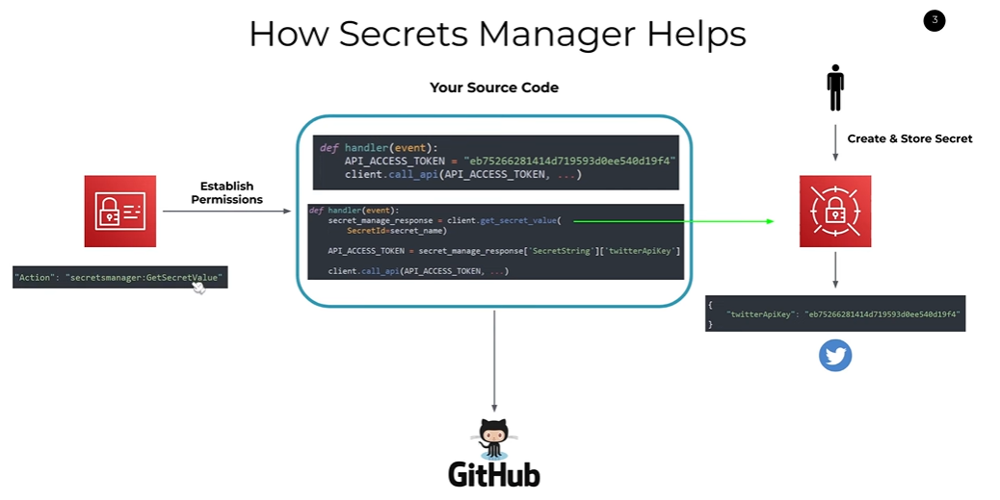
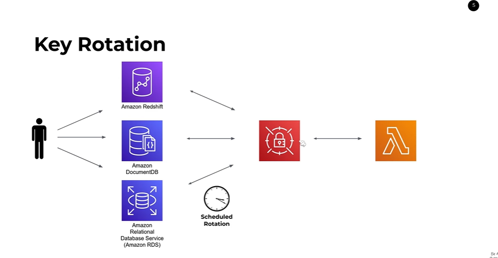

# AWS Secrets Manager

#### Overview
AWS Secrets Manager is a managed service that helps you protect access to your applications, services, and IT resources without the upfront cost and complexity associated with managing and rotating secrets manually. 

#### Key Concepts and Features
1. **Secrets**: These are confidential data such as API keys, passwords, or any other sensitive information that you need to keep secure.
2. **Secrets Storage**: Secrets are stored securely within AWS Secrets Manager and can be accessed programmatically.
3. **Encryption**: All secrets are encrypted using AWS Key Management Service (KMS).
4. **IAM Integration**: Access to secrets is tightly controlled using AWS Identity and Access Management (IAM).
5. **Rotation**: Secrets can be rotated automatically at a specified interval to enhance security.
6. **Monitoring**: AWS CloudWatch and AWS CloudTrail can be used to monitor and log access to your secrets.

#### How AWS Secrets Manager Works
1. **Storing Secrets**:
   - Create and store secrets within Secrets Manager.
   - Secrets can be a simple key-value pair or a more complex JSON object.

2. **Accessing Secrets**:
   - Use the AWS SDK or AWS CLI to programmatically retrieve secrets.
   - Access is managed through IAM policies which define who or what can access the secrets.

3. **Encryption**:
   - Secrets are encrypted using AWS KMS.
   - You can either use the default AWS-managed KMS key or a customer-managed KMS key.



4. **Automatic Rotation**:
   - AWS Secrets Manager supports automatic rotation of secrets for certain AWS services like Amazon RDS, Redshift, and DocumentDB.
   - Custom rotation can be implemented using AWS Lambda functions for other types of secrets.

5. **Monitoring and Logging**:
   - Use CloudWatch to monitor API calls to Secrets Manager.
   - CloudTrail logs can be used to audit access to secrets.

#### Practical Example
- **Scenario**: An application needs to access the Twitter API using an access token.
- **Problem**: Storing the API token directly in the source code is insecure and can lead to unauthorized access if the source code is compromised.

##### Solution with AWS Secrets Manager
1. **Create a Secret**:
   - Store the Twitter API token in AWS Secrets Manager as a secret.
   - The secret is stored in encrypted form and can only be accessed by authorized entities.

2. **Access the Secret Programmatically**:
   - Modify the application to retrieve the Twitter API token from AWS Secrets Manager at runtime.
   - The application uses the AWS SDK to call `GetSecretValue` API and retrieves the secret value.

3. **Secure Access with IAM**:
   - Configure IAM policies to ensure that only the application or specific users have the permission to access the secret.
   - Apply the principle of least privilege to minimize the risk of unauthorized access.

4. **Example Code in Python**:
   ```python
   import boto3
   import json

   def get_secret():
       secret_name = "my-twitter-api-key"
       region_name = "us-east-1"

       # Create a Secrets Manager client
       session = boto3.session.Session()
       client = session.client(service_name='secretsmanager', region_name=region_name)

       try:
           get_secret_value_response = client.get_secret_value(SecretId=secret_name)
       except Exception as e:
           raise e

       secret = get_secret_value_response['SecretString']
       secret_dict = json.loads(secret)
       return secret_dict['TwitterAPIKey']

   # Example usage
   api_key = get_secret()
   print(api_key)
   ```

#### Detailed Steps for Setting Up Secrets Manager
1. **Create a Secret**:
   - Go to the AWS Management Console.
   - Navigate to AWS Secrets Manager.
   - Click on "Store a new secret".
   - Choose the secret type (e.g., Other type of secrets for API keys).
   - Enter the key-value pairs for the secret (e.g., `TwitterAPIKey: your_api_key`).
   - Specify the KMS key for encryption.
   - Click "Next", name your secret, and complete the setup.

2. **Set Up IAM Policies**:
   - Create a new IAM role or user.
   - Attach a policy that allows the `secretsmanager:GetSecretValue` action.
   - Example IAM policy:
     ```json
     {
         "Version": "2012-10-17",
         "Statement": [
             {
                 "Effect": "Allow",
                 "Action": "secretsmanager:GetSecretValue",
                 "Resource": "arn:aws:secretsmanager:us-east-1:123456789012:secret:my-twitter-api-key"
             }
         ]
     }
     ```
   
3. **Retrieve the Secret in Your Application**:
   - Use the AWS SDK in your application code to call Secrets Manager and retrieve the secret.

4. **Configure Rotation (Optional)**:
   - If using an AWS-supported service like RDS, enable automatic rotation.
   - For custom secrets, create an AWS Lambda function to handle the rotation and specify the rotation schedule in Secrets Manager.

#### Pricing
- **Free Tier**: 30 days free for each new secret.
- **After Free Tier**:
  - $0.40 per secret per month.
  - $0.05 per 10,000 API calls to retrieve secrets.

#### Best Practices
1. **Use IAM Policies**: Restrict access to secrets using fine-grained IAM policies.
2. **Enable MFA**: Use Multi-Factor Authentication (MFA) for AWS accounts to enhance security.
3. **Regularly Rotate Secrets**: Use the rotation feature to periodically update secrets.
4. **Monitor Access**: Set up CloudWatch alarms and CloudTrail logs to monitor and audit access to your secrets.
5. **Use Encryption**: Always use KMS to encrypt your secrets.

By implementing AWS Secrets Manager, you can significantly improve the security and management of sensitive information in your applications.


For More click Here :-  [Click Here to View Blog](https://blog.gitguardian.com/handling-secrets-with-aws-secrets-manager/) 